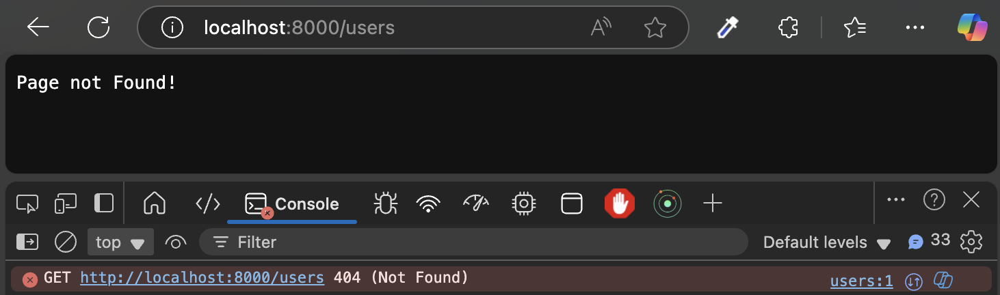
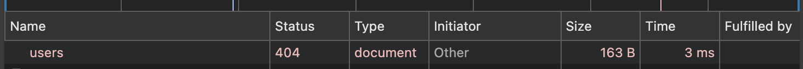
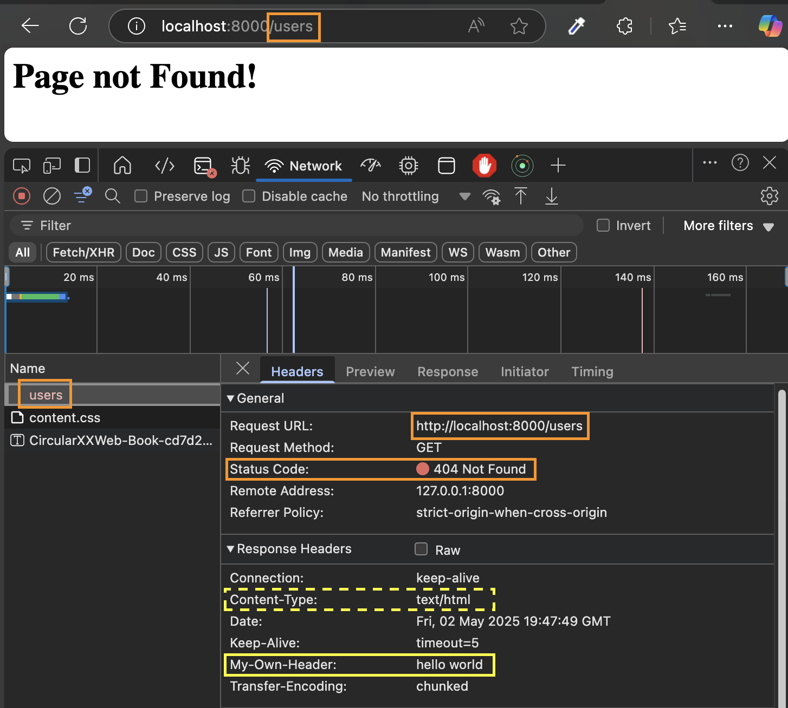

# Lecture 012: Routing

1. In top:
```js
const http = require('http')
const url = require('url')
```

2. How url works:
```js
const server = http.createServer( (req, res) => {
    console.log(req.url);
    res.end('Hello from the server!');
})
```
> You can add some route in the local host page. You will see the url from the terminal.

3. How some pages work:
```js
const server = http.createServer( (req, res) => {
    const pathName = req.url;
    if(pathName === '/' || pathName === '/overview'){
        res.end("This is the OVERVIEW page");
    } else if(pathName === '/product'){
        res.end("This is the PRODUCT page");
    } else {
        res.end('Page not Found!');
    }
})
```

4. Add `res.writeHead(404)` in else section:
```js
const server = http.createServer( (req, res) => {
    //console.log(req.url);
    const pathName = req.url;

    if(pathName === '/' || pathName === '/overview'){
        res.end("This is the OVERVIEW page");
    } else if(pathName === '/product'){
        res.end("This is the PRODUCT page");
    } else {
        res.writeHead(404);
        res.end('Page not Found!');
    }
})
```
with `res.writeHead(404)` you will be able to see this image from terminal:

from network tab in devtools:


5. Send more info as heades with `res.writeHead(404, {...})`:
```js
    else {
        //send headers
        res.writeHead(404, {
            "Content-type":"text/html",
            'my-own-header': 'hello world',
        });
        res.end('<h1>Page not Found!</h1>');
    }
```
