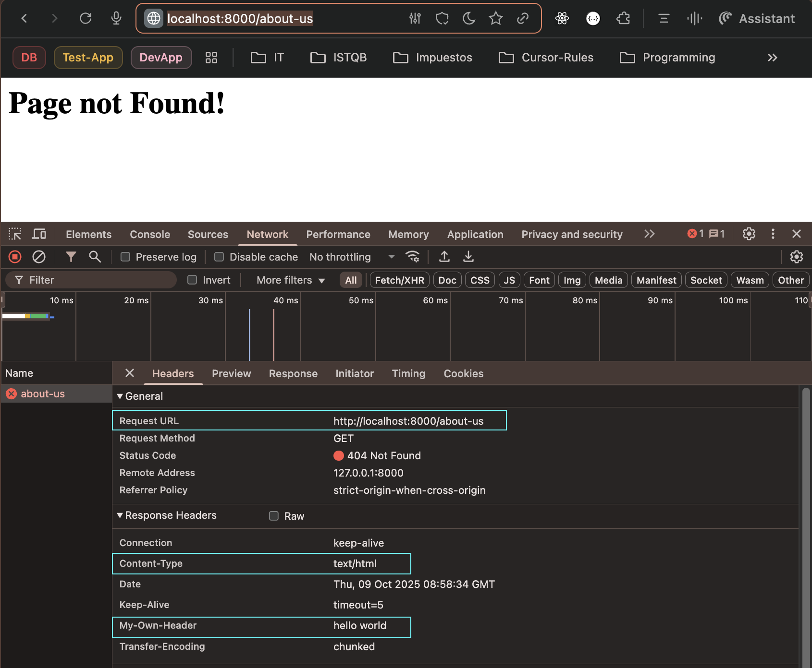

#
# 📚 Lecture 007: Using Modules 1: Core Modules

## 1. create **`index.js`** file:
```js
// ./index.js
const hello = 'Hello World';
console.log(hello);
```
### Run from terminal:
```bash
node index.js
```

## 2. Reading files:
```js
// ./index.js
const fs = require('fs')  // fs: file system and this returns an "object"
const hello = 'Hello World';
console.log(hello);
``` 

---

# 📚 Lecture 008: Reading and Writing Files
## 1. create **`./txt/input.txt`** file:
```text
The avocado 🥑 is popular in vegetarin cuisine as a substitute for meats in sandwiches and salads becuase of its high fat content 😆
```

## 2. Reading this input file content from index.js file:
```js
// ./index.js
const fs = require('fs')  // fs: file system and this returns an "object"
const inputIn = fs.readFileSync('./txt/input.txt', 'utf-8');
console.log(inputIn);
```

### Run **`node index.js`** from terminal:
```txt
The avocado 🥑 is popular in vegetarin cuisine as a substitute for meats in sandwiches and salads becuase of its high fat content 😆
```

## 3. Writing an new file: **`./txt/output.txt`** file
```js
// ./index.js
const fs = require('fs')  // fs: file system and this returns an "object"
const inputIn = fs.readFileSync('./txt/input.txt', 'utf-8');
console.log(inputIn);

const textOut = `This is what we know about the abocaddo: ${textIn}. \nCreated on ${Dat.now()}`;

fs.writeFileSync('./txt/output.txt', textOut);
console.log('File written!');
```

### Run **`node index.js`** from terminal:
1. `output.txt` has been created
```
01-node-farm/
  ├── index.js
  ├── txt/
  │   ├── input.txt
  │   └── output.txt
  └── README.md
```
2. `output.txt` content is: 
```txt
This is what we know about the abocaddo: The avocado 🥑 is popular in vegetarin cuisine as a substitute for meats in sandwiches and salads becuase of its high fat content 😆.
Created on 19651698756
```

---
# 📚 Lecture 009: Blocking and Non-Blocking: Asynchronous Nature of Node.js

> [Node Docs](https://nodejs.org/)


--- 

# 📚 Lecture 010: Reading and Writing Files **`Asynchronously`**

We will simulate a callback-hell situation.

## 1. Having those files:
```
01-node-farm/
  ├── index.js
  ├── txt/
  │   ├── append.txt
  │   ├── input.txt
  │   ├── output.txt
  │   ├── read-this.txt
  │   └── start.txt
  └── README.md
```

### each content file:
1. `./txt/start.txt`
    ```txt 
    read-this
    ```
  
2. `./txt/read-this.txt`
    ```txt
    The avocado 🥑 is also used as the base for the Mexican dip known as guacamole, as well as a spread on corn tortillas or toast, served with spices.
    ```
3. `./txt/append.txt`
    ```txt
    APPENDIX: Generally, avocados 🥑 are served raw, but some cultivars can be cooked for ashort time without becoming bitter.
    ```


## 2. Execute the following code:
```js
fs. readFile('./txt/start.txt', 'utf-8', (err, data) => {
  console.log(data);
})
console.log("Will readd file!");
```

### run from terminal:
```bash
node index.js
```

### Expected outcome:
```
Will read file!
read-this
```

## 3. Execute the following code:
```js
fs. readFile('./txt/start.txt', 'utf-8', (err, data1) => {//read-this
  fs. readFile(`./txt/${data1}.txt`, 'utf-8', (err, data2) => {
    console.log(data2);
  })
})
console.log("Will readd file!");
```

### run from terminal:
```bash
node index.js
```

### Expected outcome:
```
Will read file!
The avocado 🥑 is also used as the base for the Mexican dip known as guacamole, as well as a spread on corn tortillas or toast, served with spices.
```
## 4. Execute the following code:
```js
fs. readFile('./txt/start.txt', 'utf-8', (err, data1) => {//read-this
  fs. readFile(`./txt/${data1}.txt`, 'utf-8', (err, data2) => {
    console.log(data2);
    fs. readFile(`./txt/append.txt`, 'utf-8', (err, data3) => {
      console.log(data3);
    })
  })
})
console.log("Will readd file!");
```

### run from terminal:
```bash
node index.js
```

### Expected outcome:
```
Will read file!
The avocado 🥑 is also ised as the base for the Mexican dip known as guacamole, as well as a spread on corn tortillas or toast, served with spices.
APPENDIX: Generally, avocados 🥑 are served raw, but some cultivars can be cooked for ashort time without becoming bitter.
```
## 5. Execute the following code:
```js
fs. readFile('./txt/start.txt', 'utf-8', (err, data1) => {//read-this
  fs. readFile(`./txt/${data1}.txt`, 'utf-8', (err, data2) => {
    console.log(data2);
    fs. readFile(`./txt/append.txt`, 'utf-8', (err, data3) => {
      console.log(data3);

      fs-writeFile('./txt/final.txt', `${data2}\n${data3}`, 'utf-8', err => {
        console.log('Your file has been written 😁');
      })
    })
  })
})
console.log("Will readd file!");
```

### run from terminal:
```bash
node index.js
```

### Expected outcome:
```
Will read file!
The avocado 🥑 is also ised as the base for the Mexican dip known as guacamole, as well as a spread on corn tortillas or toast, served with spices.
APPENDIX: Generally, avocados 🥑 are served raw, but some cultivars can be cooked for ashort time without becoming bitter.
Your file has been written 😁
```

### Project Structure:
```
01-node-farm/
  ├── index.js
  ├── txt/
  │   ├── append.txt
  │   ├── final.txt
  │   ├── input.txt
  │   ├── output.txt
  │   ├── read-this.txt
  │   └── start.txt
  └── README.md
```

## 6. Pseudo handling Errors:
```js
fs. readFile('./txt/startttt.txt', 'utf-8', (err, data1) => {//read-this
  if(err) return console.log("Error 💥");
  
  // due to this error the following is ingnore!
  fs. readFile(`./txt/${data1}.txt`, 'utf-8', (err, data2) => {
    console.log(data2);
    fs. readFile(`./txt/append.txt`, 'utf-8', (err, data3) => {
      console.log(data3);

      fs-writeFile('./txt/final.txt', `${data2}\n${data3}`, 'utf-8', err => {
        console.log('Your file has been written 😁');
      })
    })
  })
})
console.log("Will readd file!");
```
---

# 📚 Lecture 011: Creating a Simple Web Server

## 1. Modify **`index.js`** file:
```js
// ./index.js
const fs = require('fs');
const http = require('http');

//create a server
const server = http.createServer((req, res) => {
  res.end("Hello from the server 👋🏽");
})

server.listen(8000, '127.0.0.1', () => {
  console.log('Listening to requests on port 8000');
})
```
### Run terminal:
```bash
node index.js
```

### expected outcome:
```txt
Listening to requests on port 8000
```

### Open a new browser tab then enter:
- http//127.0.0.1:8000

  or
- http://localhost:8000

> Hello from the server 👋🏽


## 2. Update **`index.js`** file:
```js
// ./index.js
const fs = require('fs');
const http = require('http');

//create a server
const server = http.createServer((req, res) => {
  console.log(req); // 👈🏽
  res.end("Hello from the server 👋🏽");
})

server.listen(8000, '127.0.0.1', () => {
  console.log('Listening to requests on port 8000');
})
```
### Run terminal:
```bash
node index.js
```

### expected outcome:
```txt
req (lot of info about req)
Listening to requests on port 8000
```

### Open a new browser tab then enter:
- http//127.0.0.1:8000

  or
- http://localhost:8000

> Hello from the server 👋🏽

---
# 📚 Lecture 012: Routing

## 1. Using **`url`** and the **`(req, res)`**:
```js
// ./index.js
const fs = require('fs');
const http = require('http');
const url = require('url'); // 👈🏽

//create a server
const server = http.createServer((req, res) => {
  console.log(req.url); // 👈🏽
  res.end("Hello from the server 👋🏽");
})

server.listen(8000, '127.0.0.1', () => {
  console.log('Listening to requests on port 8000');
})
```

### Run terminal:
```bash
node index.js
```

### expected terminal outcome:
```txt
Listening to request on port 8000
/
/favicon.ico
```

## 2. Go to browser and search for **`http://localhost:8000/overview`**
### Rerun terminal:
```bash
node index.js
```

### expected terminal outcome:
```txt
Listening to request on port 8000
/
/favicon.ico
/overview
/favicon.ico
```

### Any query params:
URL: **`http://localhost:8000/overview&name=no-name&country=US`**

### expected terminal outcome:
```txt
Listening to request on port 8000
/
/favicon.ico
/overview
/favicon.ico
/overview&name=no-name&country=US
/favicon.ico
```

## 3. Re-structuring:
```js
// ./index.js
const fs = require('fs');
const http = require('http');
const url = require('url'); // 👈🏽

//create a server
const server = http.createServer((req, res) => {
  const pathName = req.url;
  if(pathName === '/' || pathName === '/overview'){
    res.end("Hello from the OVERVIEW page 👋🏽");  
  } else if(pathName === '/products'){
    res.end("Hello from PRODUCTS 👋🏽");
  } else {
    res.writeHead(404, {
      'Content-type': 'text/html',
      'my-own-header':'hello-world'
    })
    res.end('<h1>Page NOT found! ⚠️</h1>')
  }
})
server.listen(8000, '127.0.0.1', () => {
  console.log('Listening to requests on port 8000');
})
```

### Browse the following URL:
- http://localhost:8000/
- http://localhost:8000/overview
- http://localhost:8000/products
- http://localhost:8000/about-us




# 📚 Lecture 013: Building a (Very) Simple API

```
API is a service from which can request some data
```

## 1. Generate a new **`/api`** route and read Asynchronously some data from **`./dev-data`** folder:
```js
// ./index.js
const fs = require('fs');
const http = require('http');
const url = require('url');
//create a server
const server = http.createServer((req, res) => {
  const pathName = req.url;
  if(pathName === '/' || pathName === '/overview'){
    res.end("Hello from the OVERVIEW page 👋🏽");  
  } else if(pathName === '/products'){
    res.end("Hello from PRODUCTS 👋🏽");
  } else if(pathName === '/api'){  // 👈🏽
    // reading ASYNC-ly from "./dev-data/data.json" file:
    fs.readFile(`${__dirname}/dev-data/data.json`, 'utf-8', (err, data) => {
      // receiving "data" right after reading data.json file:
      const productData = JSON.parse(data);
      console.log(productData)
      //sending "data" JSON to page:
      res.writeHead(200, { 'Content-type': 'application/json' })
      res.end(data);
    });
  } else {
    res.writeHead(404, {
      'Content-type': 'text/html',
      'my-own-header':'hello-world'
    })
    res.end('<h1>Page NOT found! ⚠️</h1>')
  }
})
server.listen(8000, '127.0.0.1', () => {
  console.log('Listening to requests on port 8000');
})
```

## 2. Post this new **`/api`** route and read SYNCHRONOUSLY some data from **`./dev-data`** folder:
```js
// ./index.js
const fs = require('fs');
const http = require('http');
const url = require('url');

// sync-ly reading ./dev-data/data.json: 🤯
const data = fs.readFileSync(`${__dirname}/dev-data/data.json`, 'utf-8');
const dataObj = JSON.parse(data);

//create a server
const server = http.createServer((req, res) => {
  const pathName = req.url;
  if(pathName === '/' || pathName === '/overview'){
    res.end("Hello from the OVERVIEW page 👋🏽");  
  } else if(pathName === '/products'){
    res.end("Hello from PRODUCTS 👋🏽");
  } else if(pathName === '/api'){  // 👈🏽
    res.writeHead(200, { 'Content-type': 'application/json' })
    res.end(data);
  } else {
    res.writeHead(404, {
      'Content-type': 'text/html',
      'my-own-header':'hello-world'
    })
    res.end('<h1>Page NOT found! ⚠️</h1>')
  }
})
server.listen(8000, '127.0.0.1', () => {
  console.log('Listening to requests on port 8000');
})
```

# 📚 Lecture 014: HTML Templating: Building the Templates

```
01_node_farm/
│
├── 📄 index.js                      # Main server file
├── 📄 README.md                     # Documentation with bootcamp notes
├── 📁 modules/
│   └── 📄 replaceTemplate.js        # Module to replace placeholders in templates
├── 📁 templates/
│   ├── 📄 template-overview.html    # Main page template (product list)
│   ├── 📄 template-card.html        # Individual product card template
│   └── 📄 template-product.html     # Product detail page template
├── 📁 dev-data/
│   └── 📄 data.json                 # JSON database with 5 products
├── 📁 txt/
│   ├── 📄 input.txt                 # Input file for reading exercises
│   ├── 📄 output.txt                # File generated by synchronous writing
│   ├── 📄 start.txt                 # Contains name of next file to read
│   ├── 📄 read-this.txt             # File referenced in start.txt
│   ├── 📄 append.txt                # Content to append
│   └── 📄 final.txt                 # Final file generated asynchronously
└── 📁 img/
```

## 1. modules/replaceTemplate.js (14 lines)

**Purpose**: Reusable module to replace placeholders in templates
**Parameters**:
* temp: HTML template with placeholders
* product: Object with product data

Placeholders it replaces:
*  → Product name
*  → Product emoji
*  → Price
*  → Country of origin
*  → Nutrients
*  → Quantity
*  → Description
*  → Product ID
*  → Conditional CSS class

## 2. dev-data/data.json (58 lines)
**Purpose**: Mock database with products

**Structure of each product**:
```json
{
  "id": 0,
  "productName": "Fresh Avocados",
  "image": "🥑",
  "from": "Spain",
  "nutrients": "Vitamin B, Vitamin K",
  "quantity": "4 🥑",
  "price": "6.50",
  "organic": true,
  "description": "..."
}
```

## 3. **`template-product.html`** file:
```html
<!DOCTYPE html>
<html lang="en">
  <head>
    <meta charset="UTF-8" />
    <meta name="viewport" content="width=device-width, initial-scale=1.0" />
    <meta http-equiv="X-UA-Compatible" content="ie=edge" />
    <link href="https://fonts.googleapis.com/css?family=Megrim|Nunito+Sans:400,900" rel="stylesheet" />
    <link
      rel="icon"
      href="https://emojipedia-us.s3.dualstack.us-west-1.amazonaws.com/thumbs/240/apple/155/ear-of-maize_1f33d.png"
    />

    <title>  /// NODE FARM</title>

    <style>
      *,
      *::before,
      *::after {
        margin: 0;
        padding: 0;
        box-sizing: inherit;
      }

      html {
        font-size: 62.5%;
        box-sizing: border-box;
      }

      body {
        padding: 5rem 5rem 10rem;
        line-height: 1.7;
        font-family: 'Nunito Sans', sans-serif;
        color: #555;
        min-height: 100vh;
        background: linear-gradient(to bottom right, #9be15d, #00e3ae);
      }

      h1 {
        font-family: 'Megrim', sans-serif;
        font-size: 6rem;
        color: white;
        transform: skewY(-5deg);
        text-align: center;
        position: relative;
        word-spacing: 3px;
      }

      h1::before {
        content: '';
        display: block;
        height: 65%;
        width: 49%;
        position: absolute;
        top: 105%;
        left: 50%;
        background: linear-gradient(to bottom, #9be15d, #00e3ae);
        opacity: 0.8;
        z-index: -1;
        transform: skewY(370deg) translate(-50%, -50%);
      }

      .container {
        width: 95rem;
        margin: 0 auto;
      }

      .product {
        width: 60rem;
        margin: 0 auto;
        margin-top: 9rem;
        background: white;
        box-shadow: 0 3rem 6rem 1rem rgba(0, 0, 0, 0.2);
        position: relative;
      }

      .product__hero {
        position: relative;
        height: 22rem;
        overflow: hidden;
      }

      .product__hero::before {
        content: '';
        display: block;
        height: 100%;
        width: 100%;
        position: absolute;
        top: 0;
        left: 0;
        background-image: linear-gradient(to left bottom, #9be15d, #00e3ae);
        opacity: 0.5;
        z-index: 100;
      }

      .product__emoji {
        font-size: 15rem;
        position: absolute;
      }

      .product__emoji--1 {
        top: -4rem;
        left: -2rem;
        z-index: 10;
      }

      .product__emoji--2 {
        top: -6rem;
        left: 9rem;
      }

      .product__emoji--3 {
        top: -4rem;
        right: 15rem;
      }

      .product__emoji--4 {
        top: -5rem;
        right: 2rem;
        z-index: 10;
      }

      .product__emoji--5 {
        bottom: -9rem;
        left: 18rem;
      }

      .product__emoji--6 {
        bottom: -8rem;
        left: 5rem;
      }

      .product__emoji--7 {
        bottom: -12rem;
        right: 14rem;
      }

      .product__emoji--8 {
        bottom: -8rem;
        right: -2rem;
      }

      .product__emoji--9 {
        top: -7rem;
        left: 19rem;
      }

      .product__organic {
        position: absolute;
        top: -4rem;
        right: -4rem;
        z-index: 1000;
        height: 11rem;
        width: 11rem;
        background-image: linear-gradient(to bottom, #9be15d, #00e3ae);
        border-radius: 50%;
        transform: rotate(15deg);
        box-shadow: 0 2rem 4rem rgba(0, 0, 0, 0.4);
        display: flex;
        align-items: center;
        justify-content: center;
      }

      .product__organic h5 {
        font-weight: 900;
        text-transform: uppercase;
        font-size: 1.8rem;
        color: white;
      }

      .product__back:link,
      .product__back:visited {
        position: absolute;
        top: 2rem;
        left: 2rem;
        font-size: 1.5rem;
        font-weight: 700;
        text-transform: uppercase;
        text-decoration: none;
        z-index: 1000;
        color: #555;
        background-color: white;
        box-shadow: 0 1rem 3rem rgba(0, 0, 0, 0.3);
        border-radius: 100rem;
        padding: 0 2rem;
        transition: all 0.3s;
        display: flex;
        align-items: center;
      }

      .product__back:hover,
      .product__back:active {
        background-color: #79e17b;
      }

      .product__name {
        background: linear-gradient(to bottom, #9be15d, #00e3ae);
        padding: 1rem;
        font-family: 'Megrim', sans-serif;
        font-size: 4rem;
        color: white;
        text-align: center;
        word-spacing: 2px;
      }

      .product__details {
        background-color: #eee;
        padding: 4rem 6rem;
        font-size: 1.9rem;
        display: grid;
        grid-template-columns: 1fr 1fr;
        grid-gap: 1.5rem;
      }

      .product__description {
        padding: 5rem 6rem;
        font-size: 1.6rem;
        line-height: 1.8;
      }

      .product__link:link,
      .product__link:visited {
        display: block;
        background-color: #79e17b;
        color: white;
        font-size: 1.6rem;
        font-weight: 700;
        text-transform: uppercase;
        text-decoration: none;
        padding: 1.5rem;
        text-align: center;
        transform: scale(1.07) skewX(-20deg);
        box-shadow: 0 2rem 6rem rgba(0, 0, 0, 0.2);
        display: flex;
        align-items: center;
        justify-content: center;
        transition: all 0.3s;
      }

      .product__link:hover,
      .product__link:active {
        background-color: #9be15d;
        transform: scale(1.1) skewX(-20deg);
      }

      .product__link span {
        transform: skewX(20deg);
      }

      .emoji-left {
        font-size: 2rem;
        margin-right: 1rem;
      }

      .emoji-right {
        font-size: 2rem;
        margin-left: 1rem;
      }

      .not-organic {
        display: none;
      }
    </style>
  </head>

  <body>
    <div class="container">
      <h1>🌽 Node Farm 🥦</h1>

      <figure class="product">
        <div class="product__organic "><h5>Organic</h5></div>
        <a href="/overview" class="product__back"> <span class="emoji-left">👈</span>Back </a>
        <div class="product__hero">
          <span class="product__emoji product__emoji--1"></span>
          <span class="product__emoji product__emoji--2"></span>
          <span class="product__emoji product__emoji--3"></span>
          <span class="product__emoji product__emoji--4"></span>
          <span class="product__emoji product__emoji--5"></span>
          <span class="product__emoji product__emoji--6"></span>
          <span class="product__emoji product__emoji--7"></span>
          <span class="product__emoji product__emoji--8"></span>
          <span class="product__emoji product__emoji--9"></span>
        </div>
        <!-- <h2 class="product__name">Fresh Avocados</h2> -->
        <h2 class="product__name"></h2>
        <div class="product__details">
          <p><span class="emoji-left">🌍</span>From </p>
          <p><span class="emoji-left">❤️</span> </p>
          <p><span class="emoji-left">📦</span></p>
          <p><span class="emoji-left">🏷</span>€</p>
        </div>

        <a href="#" class="product__link">
          <span class="emoji-left">🛒</span>
          <span>Add to shopping card (€)</span>
        </a>

        <p class="product__description"></p>
      </figure>
    </div>
  </body>
</html>
```

## 4. **`template-overview.html`** file:
```html
<!DOCTYPE html>
<html lang="en">
  <head>
    <meta charset="UTF-8" />
    <meta name="viewport" content="width=device-width, initial-scale=1.0" />
    <meta http-equiv="X-UA-Compatible" content="ie=edge" />
    <link href="https://fonts.googleapis.com/css?family=Megrim|Nunito+Sans:400,900" rel="stylesheet" />
    <link
      rel="icon"
      href="https://emojipedia-us.s3.dualstack.us-west-1.amazonaws.com/thumbs/240/apple/155/ear-of-maize_1f33d.png"
    />

    <title>NODE FARM</title>

    <style>
      *,
      *::before,
      *::after {
        margin: 0;
        padding: 0;
        box-sizing: inherit;
      }

      html {
        font-size: 62.5%;
        box-sizing: border-box;
      }

      body {
        padding: 5rem 5rem 10rem;
        line-height: 1.7;
        font-family: 'Nunito Sans', sans-serif;
        color: #555;
        min-height: 100vh;
        background: linear-gradient(to bottom right, #9be15d, #00e3ae);
      }

      h1 {
        font-family: 'Megrim', sans-serif;
        font-size: 6rem;
        color: white;
        transform: skewY(-5deg);
        text-align: center;
        position: relative;
        word-spacing: 3px;
      }

      h1::before {
        content: '';
        display: block;
        height: 65%;
        width: 49%;
        position: absolute;
        top: 105%;
        left: 50%;
        background: linear-gradient(to bottom, #9be15d, #00e3ae);
        opacity: 0.8;
        z-index: -1;
        transform: skewY(370deg) translate(-50%, -50%);
      }

      .container {
        width: 95rem;
        margin: 0 auto;
      }

      .cards-container {
        margin-top: 8rem;
      }

      .card {
        background: white;
        box-shadow: 0 2rem 6rem 1rem rgba(0, 0, 0, 0.15);
        margin-bottom: 5rem;
        transform: skewX(-20deg);
        display: flex;
        transition: all 0.5s;
      }

      .card__emoji {
        font-size: 5.5rem;
        line-height: 1.2;
        padding: 1.5rem 6rem 0.5rem 1.5rem;
        letter-spacing: -4rem;
        transform: skewX(20deg);
      }

      .card__title-box {
        background: linear-gradient(to bottom, #9be15d, #00e3ae);
        margin-right: auto;
        display: flex;
        align-items: center;
        padding: 0 3rem;
      }

      .card__title {
        font-family: 'Megrim', sans-serif;
        color: white;
        font-size: 3.25rem;
        transform: skewX(20deg);
      }

      .card__details {
        display: flex;
      }

      .card__detail-box {
        align-self: stretch;
        border-right: 1px solid #ddd;
        display: flex;
        align-items: center;
      }

      .card__detail-box:last-child {
        border: none;
      }

      .card__detail {
        font-weight: 400;
        font-size: 1.8rem;
        transform: skewX(20deg);
        padding: 1.75rem;
      }

      .card__detail--organic {
        font-weight: 900;
        text-transform: uppercase;
        font-size: 1.9rem;
        background-image: linear-gradient(to right, #9be15d, #00e3ae);
        -webkit-background-clip: text;
        background-clip: text;
        color: transparent;
      }

      .card__detail--price {
        font-weight: 900;
        font-size: 1.9rem;
      }

      .card__link:link,
      .card__link:visited {
        flex: 0 0 auto;
        background-color: #79e17b;
        color: white;
        font-size: 1.6rem;
        font-weight: 900;
        text-transform: uppercase;
        text-decoration: none;
        padding: 2.5rem;
        text-align: center;
        display: flex;
        align-items: center;
        justify-content: center;
        transition: all 0.3s;
      }

      .card__link:hover,
      .card__link:active {
        background-color: #9be15d;
      }

      .card__link span {
        transform: skewX(20deg);
      }

      .card:hover {
        transform: skewX(-20deg) scale(1.08);
        box-shadow: 0 3rem 8rem 2rem rgba(0, 0, 0, 0.15);
      }

      .emoji-left {
        font-size: 2rem;
        margin-right: 1rem;
      }

      .emoji-right {
        font-size: 2rem;
        margin-left: 1rem;
      }

      .not-organic {
        display: none;
      }
    </style>
  </head>

  <body>
    <div class="container">
      <h1>🌽 Node Farm 🥦</h1>

      <div class="cards-container">
        
      </div>
    </div>
  </body>
</html>
```
## 5. **`template-card.html`** file
```html
<figure class="card">
  <div class="card__emoji"> </div>
  <div class="card__title-box">
    <h2 class="card__title"></h2>
  </div>

  <div class="card__details">
    <div class="card__detail-box ">
      <h6 class="card__detail card__detail--organic">Organic!</h6>
    </div>

    <div class="card__detail-box">
      <h6 class="card__detail"> per 📦</h6>
    </div>

    <div class="card__detail-box">
      <h6 class="card__detail card__detail--price">€</h6>
    </div>
  </div>

  <a class="card__link" href="/product?id=">
    <span>Detail <i class="emoji-right">👉</i></span>
  </a>
</figure>

```
# 📚 Lecture 015: HTML Templating: Filling the Templates

## Update **`index.js`** file:
```js
// ./index,js
const fs = require('fs');
const http = require('http');
const url = require('url');
const slugify = require('slugify');
const replaceTemplate = require('./modules/replaceTemplate');
/******* SERVER *******/
const replaceTemplate = (temp, product) => {
  let output = temp.replace(//g, product.productName);
  output = output.replace(//g, product.image);
  output = output.replace(//g, product.price);
  output = output.replace(//g, product.from);
  output = output.replace(//g, product.nutrients);
  output = output.replace(//g, product.quantity);
  output = output.replace(//g, product.description);
  output = output.replace(//g, product.id);

  if(!product.organic) output = output.replace(/NOT_ORGANIC/g, 'not-organic');
  return output;
}

const tempOverview = fs.readFileSync(`${__dirname}/templates/template-overview.html`, 'utf-8');
const tempCard = fs.readFileSync(`${__dirname}/templates/template-card.html`, 'utf-8');
const tempProduct = fs.readFileSync(`${__dirname}/templates/template-product.html`, 'utf-8');

const data = fs.readFileSync(`${__dirname}/dev-data/data.json`, 'utf-8');
const dataObj = JSON.parse(data);
//console.log("dataObj: ", dataObj);

const server = http.createServer((req, res) => {
  //console.log(req.url);
  const { query, pathname } = url.parse(req.url, true); //*
  console.log(query, pathname);
  //const pathname = req.url;
  //Overview page:
  if (pathname === '/' || pathname === '/overview') {
    res.writeHead(200, { 'Content-type': 'text/html' });
    //res.end("This is the OVERVIEW page");

    const cardsHtml = dataObj.map((el) => replaceTemplate(tempCard, el)).join('');

    const output = tempOverview.replace('', cardsHtml);

    console.log(cardsHtml);
    //res.end(tempOverview);
    res.end(output);

    // Product page:
  } else if (pathname === '/product') {
    res.writeHead(200, { 'Content-type': 'text/html' });

    //console.log(query);  // [Object: null prototype] { id: '0' }
    const product = dataObj[query.id];

    output = replaceTemplate(tempProduct, product);

    //res.end("This is the PRODUCT page");
    res.end(output);

    // API:
  } else if (pathname === '/api') {
    res.writeHead(200, { 'Content-type': 'application/json' });
    res.end(data);

    // Not found:
  } else {
    //send headers
    res.writeHead(404, {
      'Content-type': 'text/html',
      'my-own-header': 'hello world',
    });
    res.end('<h1>Page not Found!</h1>');
  }
});

server.listen(8000, '127.0.0.1', () => {
  console.log('Listening to requests on port 8000');
});
```

## Run from terminal:
```bash
node index.js
```

## Click on _any_ product card.
> missing part


# 📚 Lecture 016: Parsing Variables from URLs

```js
const fs = require('fs');
const http = require('http');
const url = require('url');

/******* SERVER *******/
const replaceTemplate = (temp, product) => {
  let output = temp.replace(//g, product.productName);
  output = output.replace(//g, product.image);
  output = output.replace(//g, product.price);
  output = output.replace(//g, product.from);
  output = output.replace(//g, product.nutrients);
  output = output.replace(//g, product.quantity);
  output = output.replace(//g, product.description);
  output = output.replace(//g, product.id);

  if(!product.organic) output = output.replace(/NOT_ORGANIC/g, 'not-organic');
  return output;
}

const tempOverview = fs.readFileSync(`${__dirname}/templates/template-overview.html`, 'utf-8');
const tempCard = fs.readFileSync(`${__dirname}/templates/template-card.html`, 'utf-8');
const tempProduct = fs.readFileSync(`${__dirname}/templates/template-product.html`, 'utf-8');
const data = fs.readFileSync(`${__dirname}/dev-data/data.json`, 'utf-8');
const dataObj = JSON.parse(data);
//console.log("dataObj: ", dataObj);
const server = http.createServer((req, res) => {
  console.log(req.url); //product?id=0.    // 👈🏽 ✅
  const { query, pathname } = url.parse(req.url, true); 
  console.log("url.parse(req.url, true): \n", url.parse(req.url, true))
  /*
    url.parse(req.url, true): 
    Url {// 👈🏽 ✅
      protocol: null,
      slashes: null,
      auth: null,
      host: null,
      port: null,
      hostname: null,
      hash: null,
      search: '?id=0',
      query: [Object: null prototype] { id: '0' },  // 👈🏽 ✅
      pathname: '/product',
      path: '/product?id=0',
      href: '/product?id=0'
    }
  */
  //console.log(query, pathname);
  //const pathname = req.url; /
  //Overview page:
  if (pathname === '/' || pathname === '/overview') {
    res.writeHead(200, { 'Content-type': 'text/html' });
    //res.end("This is the OVERVIEW page");
    const cardsHtml = dataObj.map((el) => replaceTemplate(tempCard, el)).join('');
    const output = tempOverview.replace('', cardsHtml);
    console.log(cardsHtml);
    //res.end(tempOverview);
    res.end(output);
    // Product page:
  } else if (pathname === '/product') {
    res.writeHead(200, { 'Content-type': 'text/html' });
    console.log("query: ", query);  // [Object: null prototype] { id: '0' }. // 👈🏽 ✅
    const product = dataObj[query.id];
    output = replaceTemplate(tempProduct, product);
    //res.end("This is the PRODUCT page");
    res.end(output);
  } else if (pathname === '/api') {// API:
    res.writeHead(200, { 'Content-type': 'application/json' });
    res.end(data);
  } else {// Not found:
    //send headers
    res.writeHead(404, {
      'Content-type': 'text/html',
      'my-own-header': 'hello world',
    });
    res.end('<h1>Page not Found!</h1>');
  }
});

server.listen(8000, '127.0.0.1', () => {
  console.log('Listening to requests on port 8000');
});
```

> **Importante**:

1. `url`: This is a built-in module in Node.js that provides utilities for working with URLs. Before using `url.parse()`, you typically need to import this module at the beginning of your file with something like `const url = require('url');`.

2. `parse()`: This is a method from the `url` module that takes a URL string as input and returns an object containing the different parts of that URL.

3. `req.url`: This property of the `req` object (the incoming request) contains the part of the URL that follows the domain name. For example, if a client requests `http://www.example.com/products?id=123&order=desc`, then `req.url` would contain `/products?id=123&order=desc`.


# 📚 Lecture 017: Using Modules 2: Our Own Modules

## 1. create **`./modules/replaceTemplate.js`** file:
```
01_node_farm/
│
├── 📄 index.js                      # Main server file
├── 📄 README.md                     # Documentation with bootcamp notes
├── 📁 modules/
│   └── 📄 replaceTemplate.js        # Module to replace placeholders in templates 👈🏽 ✅
├── 📁 templates/
│   ├── 📄 template-overview.html    # Main page template (product list)
│   ├── 📄 template-card.html        # Individual product card template
│   └── 📄 template-product.html     # Product detail page template
├── 📁 dev-data/
│   └── 📄 data.json                 # JSON database with 5 products
├── 📁 txt/
│   ├── 📄 input.txt                 # Input file for reading exercises
│   ├── 📄 output.txt                # File generated by synchronous writing
│   ├── 📄 start.txt                 # Contains name of next file to read
│   ├── 📄 read-this.txt             # File referenced in start.txt
│   ├── 📄 append.txt                # Content to append
│   └── 📄 final.txt                 # Final file generated asynchronously
└── 📁 img/
```

## 2. **`./modules/replaceTemplate.js`** file content:
```js
module.exports = (temp, product) => {
  let output = temp.replace(//g, product.productName);
  output = output.replace(//g, product.image);
  output = output.replace(//g, product.price);
  output = output.replace(//g, product.from);
  output = output.replace(//g, product.nutrients);
  output = output.replace(//g, product.quantity);
  output = output.replace(//g, product.description);
  output = output.replace(//g, product.id);

  if(!product.organic) output = output.replace(/NOT_ORGANIC/g, 'not-organic');
  return output;
}
```

## 3. Update **`index.js`** file:
```js
const fs = require('fs');
const http = require('http');
const url = require('url');
const replaceTemplate = require('./modules/replaceTemplate');  // 👈🏽 ✅
/******* SERVER *******/
const tempOverview = fs.readFileSync(`${__dirname}/templates/template-overview.html`, 'utf-8');
const tempCard = fs.readFileSync(`${__dirname}/templates/template-card.html`, 'utf-8');
const tempProduct = fs.readFileSync(`${__dirname}/templates/template-product.html`, 'utf-8');
const data = fs.readFileSync(`${__dirname}/dev-data/data.json`, 'utf-8');
const dataObj = JSON.parse(data);
const server = http.createServer((req, res) => {
  const { query, pathname } = url.parse(req.url, true);
  if (pathname === '/' || pathname === '/overview') {//Overview page:
    res.writeHead(200, { 'Content-type': 'text/html' });
    const cardsHtml = dataObj.map((el) => replaceTemplate(tempCard, el)).join('');
    const output = tempOverview.replace('', cardsHtml);
    console.log(cardsHtml);
    res.end(output);
  } else if (pathname === '/product') {// Product page:
    res.writeHead(200, { 'Content-type': 'text/html' });
    const product = dataObj[query.id];
    output = replaceTemplate(tempProduct, product);
    res.end(output);
  } else if (pathname === '/api') {// API:
    res.writeHead(200, { 'Content-type': 'application/json' });
    res.end(data);
  } else {// Not found:
    res.writeHead(404, {//send headers
      'Content-type': 'text/html',
      'my-own-header': 'hello world',
    });
    res.end('<h1>Page not Found!</h1>');
  }
});
server.listen(8000, '127.0.0.1', () => {
  console.log('Listening to requests on port 8000');
});
```

# 📚 Lecture 018: Introduction to NPM and the package.json File

You can learrn more about npmjs.com [clicking here  ](https://www.npmjs.com)

## Execute:
```js
npm init
```

```
This utility will walk you through creating a package.json file.
It only covers the most common items, and tries to guess sensible defaults.

See `npm help init` for definitive documentation on these fields
and exactly what they do.

Use `npm install <pkg>` afterwards to install a package and
save it as a dependency in the package.json file.

Press ^C at any time to quit.
package name: (01_node_farm)
version: (1.0.0)
keybwords:
license: (ISC)
type: (commonjs)
About to write to /Users/luismedina/Desktop/WORKSPACE/NODE/complete-node-bootcamp/01_node_farm/package.json:

{
  "name": "01_node_farm",
  "version": "1.0.0",
  "description": "Learning node.js",
  "homepage": "https://github.com/luismedinacoca/complete-node-bootcamp#readme",
  "bugs": {
    "url": "https://github.com/luismedinacoca/complete-node-bootcamp/issues"
  },
  "repository": {
    "type": "git",
    "url": "git+https://github.com/luismedinacoca/complete-node-bootcamp.git"
  },
  "license": "ISC",
  "type": "commonjs",
  "main": "index.js",
  "scripts": {
    "test": "echo \"Error: no test specified\" && exit 1"
  }
  "author": "Luis Medina",
}
```

## Visual Project Structure:
```
01_node_farm/
│
├── 📄 index.js                      # Main server file
├── 📄 package.json   👈🏽 ✅          # Project configuration and dependencies
├── 📄 package-lock.json   👈🏽 ✅     # Dependencies lockfile
├── 📄 README.md                     # Documentation with bootcamp notes
├── 📁 modules/
│   └── 📄 replaceTemplate.js        # Module to replace placeholders in templates
├── 📁 templates/
│   ├── 📄 template-overview.html    # Main page template (product list)
│   ├── 📄 template-card.html        # Individual product card template
│   └── 📄 template-product.html     # Product detail page template
├── 📁 dev-data/
│   └── 📄 data.json                 # JSON database with 5 products
├── 📁 txt/
│   ├── 📄 input.txt                 # Input file for reading exercises
│   ├── 📄 output.txt                # File generated by synchronous writing
│   ├── 📄 start.txt                 # Contains name of next file to read
│   ├── 📄 read-this.txt             # File referenced in start.txt
│   ├── 📄 append.txt                # Content to append
│   └── 📄 final.txt                 # Final file generated asynchronously
├── 📁 img/
└── 📁 node_modules/   👈🏽 ✅         # Installed dependencies                
```

# 📚 Lecture 019: Types of Packages and Installs

## 1. Open terminal and run:
```bash
npm i slugify
```
  Open **`package.json`** file and you will see:
```js
"dependencies": {
    "slugify": "^1.6.6"
},
```

## 2. Open terminal and run:
```bash
npm i nodemon --save-dev
```
  Go to **`package.json`** file and you will see:
```js
"devDependencies": {
    "nodemon": "^3.1.10"
}
```

## 3. Install globally:
```bash
npm i nodemon --global
```
and for Mac users:
```bash
sudo npm i nodemon --global
```
Execute from terminal:
```bash
nodemon index.js
```
You. will see in **`package.json`** file:
```json
"devDependencies": {
  "nodemon": "^3.1.10"
}
```

## 4. Open **`package.json`** then create a new `script` command:
```js
"scripts": {
  "start": "nodemon index.js"
},
```
now open the terminal and run:
```bash
npm run start
```


# 📚 Lecture 020: Using Modules 3: 3rd Party Modules

1. User is in page **`http://localhost:3000/products`** and this page has many products to show.

2. Use **`slug`** in order. to avoid the `http://localhost:3000/products?id=1` url 

3. Slug applies `http://localhost:3000/products/fresh-avocados` as correct URL names.

## Add `Slugify` to the project:
```js
const slugify = require('slugify');
```
Review at: [slugify - npm](https://www.npmjs.com/package/slugify)

Verify how it works:
```js
console.log(slugify('Fresh Avocados', { lower: true }));
```


Using dataObj then apply slugify:
```js
const slugify = require('slugify');

// create slugs array:
const slugs = dataObj.map(el => slugify(el.productName, {lower: true}));
console.log('🤪 slugs', slugs);
```

having an array as:
```js
[
  'fresh-avocados',
  'goat-and-sheep-cheese',
  'apollo-broccoli',
  'baby-carrots',
  'sweet-corncobs'
]
```


# 📚 Lecture 021: Package Versioning and Updating


In order to know which package is outdated:
```bash
npm outdated
```
